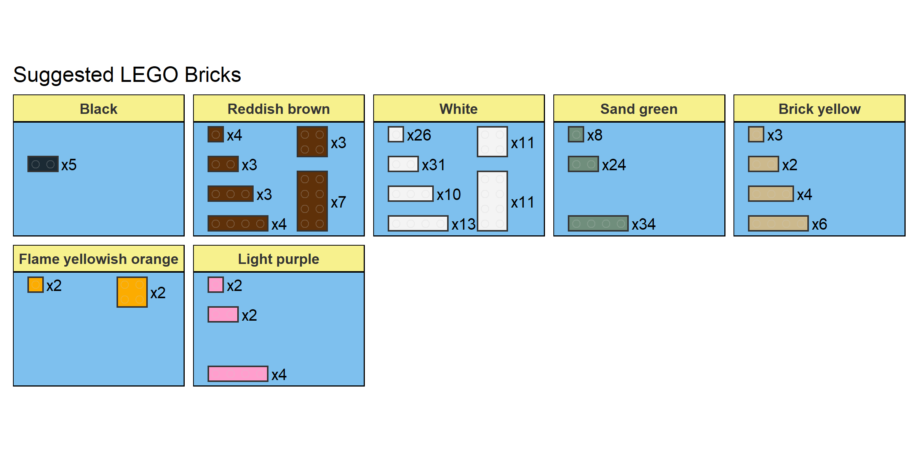

<!-- README.md is generated from README.Rmd. Please edit that file -->

```{r, include = FALSE}
knitr::opts_chunk$set(
  collapse = TRUE,
  echo = FALSE,
  comment = "#>",
  out.width = "100%"
)
source("build.R")
```

# Baby Yoda

This repository contains the detailed brick requirements and building instructions for creating your own Baby Yoda Lego model. The model was built using the [`brickr`](https://github.com/ryantimpe/brickr) R package, and was adapted from the Baby Yoda model originally designed by [Ryan Timpe](https://github.com/ryantimpe) (see [here](https://gist.github.com/ryantimpe/3893fdd0f94138d027bae35bf38b57c7) for the code for that model). The adaption was necessary, as the original model contained a number of "floating bricks" (i.e. bricks that are not supported by another brick from either above or below), which work fine when rendering the model in R but cannot be used in a physical version.


# Finished model

``` {r}
knitr::include_graphics("finished_model/Finished_model.jpeg")
```

More photos of the finished model from different angles can be found [here](/finished_model).

# Build pieces and instructions

## Build pieces

These are the pieces you will need to build your own Baby Yoda. These can be acquired from the Pick A Brick service on the Lego store website. The total cost for all pieces included in this model was ~£30 pounds.

``` {r}

```

Here is the same information as a table:

``` {r}
babyyoda %>% 
  build_pieces_table() %>%
  dplyr::select(-Piece) %>%
  knitr::kable()
```

## Instructions

The instructions below will guide you through building your own Baby Yoda, using the pieces detailed above:

``` {r}
knitr::include_graphics("babyyoda_instructions.png")
```


